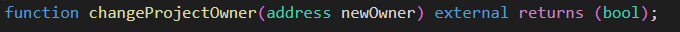

# Smartcontract Firewall


## 如何使用
### 防火墙接入

1. 项目方创建自己的合约，

   contract example：
```solidity
contract DemoToken is ERC20 {

   constructor() ERC20("DemoToken", "DemoToken") {}

   function mint(address addr,uint256 num) public {
      _mint(addr, num);
   } 
}
```


2. 项目方部署  `DemoContract` 合约，合约需继承自 `FirewallFeature`

```solidity
contract DemoContract is FirewallFeature {
    using FirewallCheck for IERC20;

    function withdrawToken(
        IERC20 token,
        address to,
        uint256 value
    ) external returns (bool) {
        token.firewallTransfer(to, value);
        return true;
    }

    function buyToken(
        IERC20 token,
        address from,
        address to,
        uint256 value
    ) external returns (bool) {
        token.firewallTransferFrom(from, to, value);
        return true;
    }
}
```

3. 项目方调用 ```DemoContract``` 中的  ```firewallTransfer``` 和  ```firewallTransferFrom``` 两个方法进行交易时，才会触发防火墙保护机制。

### 防火墙使用

#### 防火墙阻断 DemoContract 中代币交易

防火墙可以对项目方合约 ```DemoContract``` 中的代币产生交易进行保护

1. 调用合约中  `register` 方法进行注册。通过防火墙 proxy 地址，项目方将自己想要保护的 token 和该 token 的转账限额配置到防火墙，防火墙将开启对该 token 的大额交易进行保护，将超过转账限额的交易进行阻断。

   - 当针对所配置 token 发生超过限额转账时，防火墙会将该笔交易 `to` 地址添加至防火墙黑名单。所有处于防火墙黑名单的地址，在发起交易时，防火墙会预先进行模拟执行，并发出 revert 警告。

   Calldata example:

   ```solidity
   0x2468a1d3000000000000000000000000d7acd2a9fd159e69bb102a1ca21c9a3e3a5f771b00000000000000000000000000000000000000000000000000000000004c4b40
   ```

   

2. 项目方也可以将已知的黑地址添加到防火墙黑名单中。调用 `setSpecialBlacklist` 方法，参数说明如下：

   | Field             | Description                      |
   | ----------------- | -------------------------------- |
   | projectBlackAddr  | 指定黑地址                        |
   | status            | true or false, true 即添加黑名单 |

   Calldata example:

   ```solidity
   0xdc7adc5c0000000000000000000000004b20993bc481177ec7e8f571cecae8a9e22c02db000000000000000000000000d7acd2a9fd159e69bb102a1ca21c9a3e3a5f771b0000000000000000000000000000000000000000000000000000000000000001
   ```

   

3. 项目方可以在后期更改转账限额。调用 `setMaxTransferAmount` 方法，参数说明如下：

   | Field              | Description      |
   | -----------------  | ---------------- |
   | token              |  合约 token 地址  |
   | Maxtransferamount |  转账限额         |

   Calldata example:

   ```solidity
   0xb7280d01000000000000000000000000d7acd2a9fd159e69bb102a1ca21c9a3e3a5f771b000000000000000000000000000000000000000000000000000000001dcd6500
   ```

   

4. 项目方可以更改自己项目的所有者权限。调用 `changeProjectOwner` 方法，参数说明如下：

   | Field                | Description      |
   | -------------------- | ---------------- |
   | newOwner             |  新的owner地址    |

   Calldata example:

   ```solidity
   0x3224cd0b000000000000000000000000d7acd2a9fd159e69bb102a1ca21c9a3e3a5f771b000000000000000000000000617f2e2fd72fd9d5503197092ac168c91465e7f2
   ```

   

